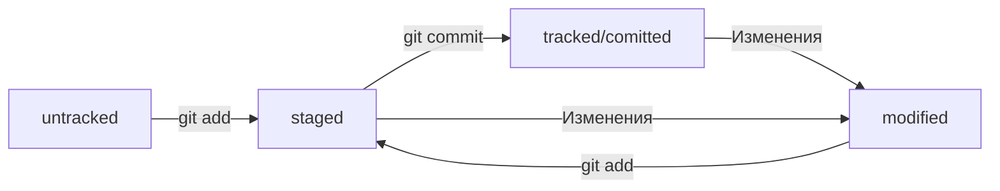

# Изучение Git

## Работа с локальным репозиторием

### Сделать папку репозиторием 
Чтобы Git начал отслеживать изменения в проекте, папку с файлами этого проекта нужно сделать
Git-репозиторием


```bash
	cd path-to-project
	git init  	
```


### "Разгитить" папку
В подпапке .git хранится история изменений. Если удалить .git,
то вся история проекта будет стёрта без возможности
восстановления — останется только последняя версия файлов.


```bash
	cd path-to-project
	rem -rf .git
```


### Проверить состояние репозитория

```bash
	cd path-to-project
	git status
```
Команда git status выведет:
1. Название текущей ветки: On branch master или On branch main;
2. Сообщение о том, что в репозитории ещё нет коммитов: No commits yet;
3. Сообщение, которое говорит: «чтобы что-нибудь закоммитить (то есть
зафиксировать), нужно сначала этосоздать» — nothing to commit
(create/copy files and use "git add" to track).


### Добавить файлы к репозиторию

```bash
	git add filename	# добавление файла
	git add --all		# добавление всех ранее не добавленных файлов
	git add .		# добавление всей папки с проектом целиком
```


### Выполинть коммит

Сделать коммит можно командой git commit c ключом -m (от англ. message —
«сообщение»), который присваивает коммиту сообщение.

Пример:
```bash
	git commit -m ‘Мой первый коммит!’ 
```

Команда git commit выведет информацию о коммите.
[master (root-commit) baa3b6e] значит:
* коммит был в ветке master;
* root-commit — это самый первый, или «корневой» (англ. root), коммит в ветке, у
следующих коммитов такой надписи не будет;
* baa3b6e — сокращённый идентификатор коммита (хэш).

2 files changed, 1 insertion(+) значит:
* изменились два файла (readme.txt и todo.txt);
* одна строка была добавлена (1. Пройти пару уроков по Git.).
Строки вида create mode 100644 readme.txt — это более подробная информация о новых
(добавленных в Git) файлах.  
create (англ. «создать») говорит, что файл был создан. Если бы файл был удалён, на
этом месте было бы слово delete (англ. «удалить»).  
mode 100644 сообщает, что это обычный файл. Также возможны варианты 100755 для
исполняемых файлов (например, что-нибудь.exe) и 120000 для файлов-ссылок в Linux.
Файлы-ссылки не содержат данных сами по себе, а только ссылаются на другие файлы —
как «ярлыки» в Windows.


### Просмотр истории коммитов

```bash
	git log
```


## Работа с удаленным репозиторием
[GitHub](https://github.com/ "Перейти на сайт GitHub") — платформа для хранения IT-проектов и совместной работы над ними с
использованием Git. По сути, это сайт, куда можно загрузить файлы своего проекта
для обмена с другими людьми.

Git и GitHub — это два разных проекта, которые развиваются независимо друг от друга. 
Git:
* консольный инструмент для работы с локальными и удалёнными репозиториями;
* проект с открытым исходным кодом.
GitHub:
* платформа для размещения удалённых репозиториев;
* принадлежит компании Microsoft.


### Создание удаленного репозитория
Зайдите в свой профиль по ссылке https://github.com/username, где username — имя, которое
вы указали при регистрации.  
Эта страница — презентация вас и ваших проектов. Её видят другие пользователи.
Надпись You don't have any public repositories yet (англ. «у вас пока нет
публичных репозиториев») сообщает, что пока у вас нет проектов.

Создайте репозиторий. Для этого перейдите на вкладку Repositories (англ. «репозитории»),
а затем нажмите на зелёную кнопку New (англ. «новый») справа.  
Открылось окно создания нового репозитория. Назовите его first-project. Название удалённого
репозитория необязательно должно совпадатьс именем папки проекта у вас на компьютере. Но чтобы
не путаться, будем называть их одинаково.  
Готово! Удалённый репозиторий создан. Страница с ним открывается автоматически. 


## Привязать удаленный репозиторий к локальному
Перейдите на страницу удалённого репозитория, выберите тип SSH и скопируйте URL. Кнопка
справа позволит сделать это мгновенно.  
Откройте консоль, перейдите в каталог локального репозитория и введите команду
git remote add (от англ. remote — «удалённый» и add — «добавить»).

```bash
	cd path-to-project
	git remote add origin git@github.com:%ИМЯ_АККАУНТА%/project-name.git
```
Команде необходимо передать два параметра: имя удалённого репозитория и его URL. В качестве
имени используйте слово origin. А URL вы скопировали со страницы удалённого репозитория.  
origin (англ. «источник») — стандартный псевдоним, с помощью которого можно обращаться к
главному удалённому репозиторию (обычно такой репозиторий один). Это значительно упрощает работу.


### Убедиться, что репозитории связаны
```bash
	git remote -v
```


### Отправить изменения на удаленный репозиторий

Вы уже прошли весь «цикл коммита»: подготовили файлы с помощью git add, закоммитили
их с комментарием командой git commit -m. Осталось загрузить содержимое локального
репозитория на GitHub.За это отвечает команда git push (от англ. push — «толкать»).  
В первый раз эту команду нужно вызвать с флагом -u и параметрами origin (имя
удалённого репозитория) и main или master (название текущей ветки). Флаг -u свяжет
локальную ветку с одноимённой удалённой. Как вы связывали локальный и удалённый
репозитории в предыдущем уроке, так же и здесь нужно дополнительно связать ветки.

```bash
	git push -u origin main
```


## Работа с файлом README.md

Как правило, в README.md проекта можно найти следующую информацию:
1. Название проекта и его краткое описание: кем создан, для чего, какие решает задачи
и какие закрывает проблемы.
2. Технологии, которые применяются в проекте. В чём его отличие от аналогичных.
3. Документация проекта — подробная инструкция о том, что представляет собой проект.
4. Планы проекта, если они есть.


### Заголовки, абзацы, перенос
* Заголовки разных уровней создают решетками
```md
	# H1 — заголовок первого уровня, самый большой
	## H2 — заголовок второго уровня, поменьше
	### H3
	#### H4
	##### H5
	###### H6 — заголовок шестого уровня, самый маленький 
```
* Можно добавить черту под заголовками или абзацем
```md
	#### Заголовок 4

	Текст над чертой

	---

	Текст под чертой 
```
* Чтобы сделать разрыв строки, нужно поставить два пробела (в примере ниже они
обозначены точками ⋅⋅) или сочетание символов <br>.
* Чтобы начать новый параграф, в конце предыдущей строки должно стоять два символа
переноса. Для этого нужно нажать Enter два раза.


### Выделение текста
* Чтобы выделить текст курсивом (*текст*), его заключают в звёздочки
(астериски) или нижние подчёркивания.
* Чтобы выделить текст полужирным шрифтом (**текст**), его окружают двойными звёздочками
или двойными нижними подчёркиваниями.
* Чтобы зачеркнуть текст (~~текст~~), его окружают двойными волнистыми линиями — тильдами.


### Списки
* Для оформления нумерованного списка достаточно поставить в начало строки цифры с точкой.
* Ненумерованный список создаётся звёздочкой с пробелом в начале строки либо дефисом с пробелом.


### Ссылки
Чтобы сделать ссылкой часть текста, его заключают в квадратные скобки, а затем указывают
нужный адрес в круглых скобках.
```md
	[Яндекс](https://www.yandex.ru) 
```
Также можно добавить ссылке тайтл (от англ title — «название», «заголовок»).
Тайтл — это всплывающая подсказка, которая появляется при наведении мыши на ссылку.
Тайтл нужно заключить в кавычки и указать внутри скобок после адреса.
```md
	[Яндекс](https://www.yandex.ru "Я Yandex!")
```


### Код
Чтобы оформить текст как код, нужно окружить его тройками косых кавычек — грависов.
После первой тройки грависов указывают язык программирования, на котором написан код.
В маркдауне есть поддержка синтаксиса почти всех популярных языков и инструментов.
```md
	```bash
		ls - la
	```
	```html
		<h1>А я просто текст</h1>
	``` 
```

## Информация о репозитории
### Хэш
Хеширование (от англ. hash, «рубить», «крошить», «мешанина») — это способ преобразовать
набор данных и получить их «отпечаток» (англ. fingerprint).  
Информация о коммите — это набор данных: когда был сделан коммит, содержимое файлов
в репозитории на момент коммита и ссылка на предыдущий, или родительский (англ. parent), коммит.  
Git хеширует (преобразует) информацию о коммите с помощью алгоритма SHA-1 (от англ.
Secure Hash Algorithm — «безопасный алгоритм хеширования») и получает для каждого
коммита свой уникальный хеш — результат хеширования.  
Git хранит таблицу соответствий хеш → информация о коммите. Если вы знаете хеш,
вы можете узнать всё остальное: автора и дату коммита и содержимое закоммиченных
файлов. Можно сказать, что хеш — основной идентификатор коммита.  

Получение истории коммитов:
```bash
	git log			# полный список
	git log --oneline	# сокращенный список
```

### Файл Head
Файл HEAD (англ. «голова», «головной») — один из служебных файлов папки .git. Он
указывает на коммит, который сделан последним (то есть на самый новый).  
Внутри HEAD — ссылка на служебный файл: refs/heads/master (или refs/heads/main
в зависимости от названия ветки). Если заглянуть в этот файл, можно увидеть
хеш последнего коммита.  
Когда вы делаете коммит, Git обновляет refs/heads/master — записывает в него
хеш последнего коммита. Получается, что HEAD тоже обновляется, так как ссылается
на refs/heads/master.

### Статусы файлов

Одна из ключевых задач Git — отслеживать изменения файлов в репозитории.
Для этого каждый файл помечается каким-либо статусом. Рассмотрим основные.
* untracked (англ. «неотслеживаемый»)

Новые файлы в Git-репозитории помечаются как untracked, то есть неотслеживаемые. Git «видит», что такой файл существует, но не следит за изменениями в нём. У untracked-файла нет предыдущих версий, зафиксированных в коммитах или через команду git add.
* staged (англ. «подготовленный»)

После выполнения команды git add файл попадает в staging area (от англ. stage — «сцена»,
«этап [процесса]» и area — «область»), то есть в список файлов, которые войдут в коммит.
В этот момент файл находится в состоянии staged.

* tracked (англ. «отслеживаемый»)

Состояние tracked — это противоположность untracked. Оно довольно широкое по
смыслу: в него попадают файлы, которые уже были зафиксированы с помощью git commit,
а также файлы, которые были добавлены в staging area командой git add. То есть
все файлы, в которых Git так или иначе отслеживает изменения.
* modified (англ. «изменённый»)

Состояние modified означает, что Git сравнил содержимое файла с последней
сохранённой версией и нашёл отличия. Например, файл был закоммичен и после этого изменён.



